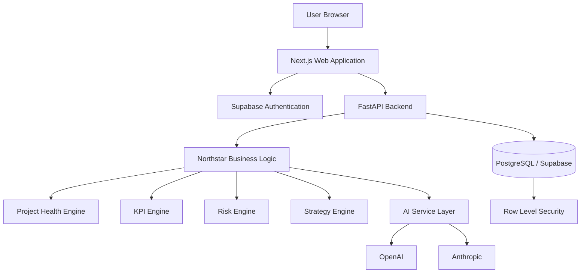

# Northstar Technical Architecture

## 1. Architecture Overview

Northstar is a multi-tenant Management Intelligence & Strategy Execution Platform.

The architecture is designed around four major layers:

1. User interface
2. Application and business logic
3. Data and authentication
4. Management intelligence

Northstar should remain useful even without AI.

Core calculations, permissions, project health, KPI status, and risk logic should be deterministic application logic. AI is used primarily to interpret structured information and produce management-oriented analysis.

---

## 2. Architecture Principles

Northstar will be designed according to the following principles:

- Multi-tenant from the beginning
- Secure by default
- Clear separation between frontend, backend, data, and AI
- Business logic should not depend entirely on AI models
- Modular architecture
- Testable components
- Maintainable code
- SaaS-ready without unnecessary enterprise complexity
- Provider-independent AI integration
- Least-privilege access to organizational data

---

## 3. High-Level Architecture



---

## 4. Frontend Architecture

### Technologies

- Next.js
- React
- TypeScript
- Tailwind CSS

### Responsibilities

The frontend will provide the user-facing Northstar experience, including:

- Authentication screens
- Organization onboarding
- Executive dashboard
- Strategic objectives
- Project portfolio
- Milestones
- KPIs
- Risks
- Reports
- Organization settings

### Why Next.js

Next.js provides a structured React framework with routing, server-side capabilities, strong TypeScript support, and a mature deployment ecosystem.

### Why React

React provides a component-based model for building interactive user interfaces and supports the dashboard-heavy nature of Northstar.

### Why TypeScript

Northstar will contain many structured entities such as projects, risks, KPIs, objectives, users, and organizations.

TypeScript provides static type checking that can detect many errors before runtime and makes a growing codebase easier to maintain.

### Why Tailwind CSS

Tailwind CSS provides a consistent utility-based styling system that supports rapid UI development while maintaining design consistency.

---

## 5. Backend Architecture

### Technologies

- Python
- FastAPI

### Responsibilities

The backend will manage:

- Business logic
- Data validation
- Project health calculations
- KPI calculations
- Risk calculations
- Strategic alignment logic
- Authorization checks
- AI orchestration
- Future forecasting and analytics
- API endpoints

### Why Python

Python provides a strong foundation for analytics, optimization, statistical modelling, AI integration, and future management-science functionality.

### Why FastAPI

FastAPI provides:

- Typed API development
- Automatic API documentation
- Strong Python integration
- Validation
- Asynchronous request support
- Clean separation between frontend and backend

---

## 6. Database Architecture

### Technology

PostgreSQL hosted through Supabase.

### Why PostgreSQL

Northstar's data is highly relational.

Examples include:

- Organizations contain members
- Organizations contain strategic objectives
- Objectives relate to projects
- Projects contain milestones
- Objectives relate to KPIs
- KPIs contain measurements
- Risks relate to projects or objectives

A relational database provides strong integrity and supports these relationships naturally.

PostgreSQL also provides mature support for:

- Foreign keys
- Constraints
- Transactions
- Indexing
- Complex queries
- Row Level Security

---

## 7. Initial Core Data Entities

Initial entities will include:

- User
- Organization
- Organization Member
- Strategic Objective
- Project
- Milestone
- KPI
- KPI Measurement
- Risk

Additional entities will be introduced through future releases.

### Initial Relationship Model

```text
User
  |
  v
Organization Member
  |
  v
Organization
  |
  +--> Strategic Objectives
  |       |
  |       +--> Projects
  |       |
  |       +--> KPIs
  |
  +--> Risks
  |
  +--> Members
```

A more detailed database schema will be defined separately.

---

## 8. Authentication

### Technology

Supabase Auth.

Authentication answers:

> Who is the user?

Supabase Auth will initially provide:

- Email/password authentication
- User session management
- Secure authentication tokens
- Password reset functionality

Additional authentication methods may be added later.

Potential future authentication methods include:

- Google OAuth
- Microsoft OAuth
- Enterprise SSO

---

## 9. Multi-Tenant Architecture

Northstar is designed as a multi-tenant SaaS application.

Multiple organizations will use the same application while maintaining strict separation between their data.

Most organization-owned entities will therefore include:

`organization_id`

Example:

```text
projects

id
organization_id
name
status
owner_id
start_date
target_date
```

Every organization-specific query must be scoped to the user's authorized organization.

### Tenant Isolation Principle

If User A belongs to Organization A, that user must never be able to access Organization B's:

- Projects
- Objectives
- KPIs
- Risks
- Members
- Reports
- Management intelligence

Tenant isolation will be enforced at both the application and database levels.

---

## 10. Row Level Security

Supabase Row Level Security will provide an additional database-level security layer.

A user must not be able to retrieve another organization's information even if a malicious request is sent directly to the database API.

Access policies will verify organization membership before allowing access to protected records.

Application-level authorization and database-level Row Level Security will work together.

Conceptually:

```text
User requests protected record
        |
        v
Application authorization check
        |
        v
Database RLS policy
        |
        v
Organization membership verified
        |
        +--> Allowed
        |
        +--> Denied
```

---

## 11. Authorization

Authentication determines who the user is.

Authorization determines what that user is allowed to do.

Northstar's initial role model will support:

| Role | General Access |
| --- | --- |
| Owner | Full organization control |
| Admin | Organization and user administration |
| Manager | Manage strategy, projects, KPIs, and risks |
| Member | Work with permitted organizational content |
| Viewer | Read-only access |

The MVP will avoid highly complex permission configuration.

More granular permissions may be introduced later.

Authorization checks should occur server-side for protected operations.

---

## 12. Business Logic Layer

Northstar's management intelligence must not depend entirely on AI.

The backend will contain deterministic services such as:

```text
Project Health Engine
KPI Engine
Risk Engine
Strategy Engine
```

These services will calculate structured results.

For example:

```text
Project Health Score

Schedule Performance
Budget Performance
Milestone Completion
Risk Exposure
Resource Capacity
```

The AI layer may then explain those calculated results to management.

### Principle

Northstar should calculate facts.

AI should interpret those facts.

---

## 13. AI Architecture

Northstar will use a provider-independent AI service layer.

Application code should call internal functionality such as:

```text
generate_management_brief()
analyze_project_risk()
explain_kpi_change()
```

rather than depending directly on a specific vendor model.

Conceptually:

```text
Northstar
   |
   v
AI Service
   |
   +-- OpenAI Adapter
   |
   +-- Anthropic Adapter
   |
   +-- Future Provider
```

This provides flexibility if model capabilities, pricing, or providers change.

### AI Responsibilities

AI may be used for:

- Executive management briefs
- Risk explanations
- KPI interpretation
- Strategic summaries
- Management recommendations
- Natural-language querying

### AI Limitations

AI will not be treated as the source of truth for:

- Permissions
- Financial calculations
- Project health calculations
- KPI values
- Risk scores
- Organization access control
- Database integrity

Those functions will remain deterministic.

---

## 14. Initial Management Intelligence Engines

Northstar will gradually introduce dedicated business-logic engines.

### Project Health Engine

Potential inputs:

- Schedule performance
- Budget performance
- Milestone completion
- Risk exposure
- Resource capacity

Potential output:

```text
Project Health Score: 74/100
Status: At Risk
```

### KPI Engine

Responsible for:

- Tracking KPI targets
- Recording measurements
- Calculating variance
- Identifying threshold breaches
- Detecting deteriorating performance

### Risk Engine

Responsible for:

- Probability
- Impact
- Risk exposure
- Mitigation status
- Related objectives and projects

### Strategy Engine

Responsible for:

- Connecting objectives and projects
- Monitoring strategic execution
- Identifying objectives with insufficient supporting activity
- Supporting future strategic-alignment scoring

---

## 15. API Architecture

The frontend will communicate with the backend through structured API endpoints.

Examples may include:

```text
GET    /organizations
POST   /organizations

GET    /objectives
POST   /objectives

GET    /projects
POST   /projects

GET    /kpis
POST   /kpis

GET    /risks
POST   /risks
```

The backend will:

- Validate requests
- Authenticate users
- Enforce authorization
- Execute business logic
- Communicate with the database
- Return structured responses

The API structure will evolve as the product develops.

---

## 16. Hosting and Deployment

Initial infrastructure:

### Frontend

Vercel

### Backend

Render or Railway

### Database and Authentication

Supabase

### Source Control

GitHub

Conceptually:

```text
GitHub
   |
   +----> Vercel
   |       |
   |       +--> Next.js Frontend
   |
   +----> Render / Railway
           |
           +--> FastAPI Backend
                    |
                    v
                 Supabase
              PostgreSQL/Auth
```

This architecture provides a low-cost development path while preserving the ability to scale later.

---

## 17. Testing Strategy

Northstar will use multiple testing layers.

### Frontend Unit Testing

Technology:

- Vitest

Used for:

- Utility functions
- Components
- State logic
- Validation

### Backend Testing

Technology:

- Pytest

Used for:

- API endpoints
- Business logic
- Scoring engines
- Authorization logic
- Validation

### End-to-End Testing

Technology:

- Playwright

Example workflow:

```text
Login
   ↓
Create Organization
   ↓
Create Objective
   ↓
Create Project
   ↓
Create KPI
   ↓
View Executive Dashboard
```

This verifies that the complete application works from the user's perspective.

---

## 18. CI/CD Strategy

GitHub Actions will eventually run automated checks on pull requests.

Potential workflow:

```text
Pull Request
     |
     v
Lint
     |
     v
Type Check
     |
     v
Frontend Tests
     |
     v
Backend Tests
     |
     v
Build Verification
```

A pull request should not be merged if required automated checks fail.

Deployment automation can later deploy approved changes after they are merged into `main`.

---

## 19. Environment Variables and Secrets

Sensitive credentials must never be committed to GitHub.

Examples include:

```text
DATABASE_URL
SUPABASE_URL
SUPABASE_ANON_KEY
SUPABASE_SERVICE_ROLE_KEY
OPENAI_API_KEY
ANTHROPIC_API_KEY
```

Local credentials will be stored in environment files such as:

```text
.env
.env.local
```

These files will be excluded from Git using `.gitignore`.

Production secrets will be stored through the hosting provider's secure environment-variable system.

An example file such as:

```text
.env.example
```

may later document required environment variables without exposing real secrets.

---

## 20. Logging and Monitoring

During early development, Northstar will use basic application logging.

Initial logging should support:

- API errors
- Authentication failures
- Database errors
- AI request failures
- Application exceptions

Future monitoring may include:

- Performance monitoring
- Error tracking
- Uptime monitoring
- Deployment failures
- AI usage monitoring
- Cost monitoring

As the application matures, dedicated observability tools may be introduced.

---

## 21. Repository Structure

The intended repository structure is:

```text
northstar/
│
├── apps/
│   └── web/
│       └── Next.js frontend
│
├── services/
│   └── api/
│       └── FastAPI backend
│
├── database/
│   └── migrations/
│
├── docs/
│   ├── product-requirements.md
│   ├── architecture.md
│   └── decisions/
│
├── tests/
│
├── .github/
│   └── workflows/
│
├── README.md
├── .gitignore
└── LICENSE
```

The repository will remain a monorepo during the MVP.

This allows the frontend, backend, documentation, tests, and infrastructure configuration to remain within one GitHub repository.

---

## 22. GitHub Development Workflow

Northstar will follow an issue-driven development workflow.

```text
GitHub Issue
     ↓
Feature Branch
     ↓
Implementation
     ↓
Commit
     ↓
Push
     ↓
Pull Request
     ↓
Review
     ↓
Automated Testing
     ↓
Merge into main
```

Major features should not normally be developed directly on `main`.

Branch names should communicate their purpose.

Examples:

```text
feature/objective-management
feature/kpi-engine
fix/project-health-calculation
docs/database-schema
```

Each pull request should:

- Reference the related issue
- Describe the changes
- Include testing information
- Be reviewed before merge
- Pass required automated checks when CI/CD is enabled

---

## 23. Initial Deployment Environments

Northstar will eventually use separate environments.

### Local

Used for active development.

### Preview

Used for testing pull requests and feature branches.

### Production

Used for the stable public application.

Production data and development data must remain separated.

Production credentials must not be reused for local development.

---

## 24. Security Principles

Northstar will follow several baseline security principles:

- Organization data must remain tenant-isolated
- Authentication is required for protected features
- Authorization checks must occur server-side
- Database Row Level Security should protect tenant data
- Secrets must never be committed to GitHub
- User input must be validated
- Sensitive operations should follow least-privilege principles
- Production credentials must be separate from development credentials
- AI models should only receive data required for the specific task
- Service-role credentials must never be exposed to the browser

More advanced security controls will be introduced as Northstar approaches commercial deployment.

---

## 25. Future Architecture Considerations

Future versions may introduce:

- Background job processing
- Caching
- Real-time notifications
- Advanced audit logging
- Organization-level usage limits
- Stripe subscription billing
- Enterprise SSO
- Third-party integrations
- Data export
- Advanced analytics
- Forecasting
- Resource optimization
- Scenario modelling
- Decision intelligence
- Dedicated AI queues
- Advanced monitoring
- Enterprise compliance controls

These capabilities are intentionally excluded from the initial architecture unless required by the MVP.

---

## 26. Architecture Summary

Northstar's initial architecture will use:

| Layer | Technology |
| --- | --- |
| Frontend | Next.js, React, TypeScript |
| Styling | Tailwind CSS |
| Backend | Python, FastAPI |
| Database | PostgreSQL |
| Database Platform | Supabase |
| Authentication | Supabase Auth |
| Tenant Security | Row Level Security |
| AI | Provider-independent service layer |
| Frontend Hosting | Vercel |
| Backend Hosting | Render or Railway |
| Source Control | GitHub |
| CI/CD | GitHub Actions |
| Frontend Testing | Vitest |
| Backend Testing | Pytest |
| End-to-End Testing | Playwright |

This architecture is intended to support Northstar's MVP while providing a clear path toward a commercial multi-tenant SaaS platform.