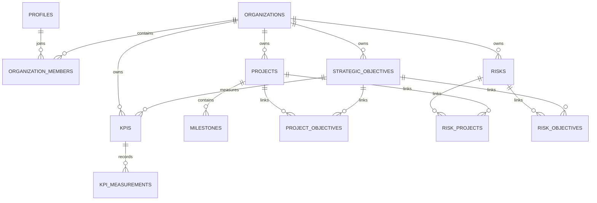

# Northstar Initial Database Schema

## 1. Purpose

This document defines the initial relational database design for Northstar's MVP.

Northstar is a multi-tenant Management Intelligence & Strategy Execution Platform. The database must support:

- Organizations
- Organization membership and roles
- Strategic objectives
- Projects
- Project milestones
- KPIs and KPI history
- Organizational and project risks
- Strict tenant isolation
- Future SaaS growth

The initial database will use PostgreSQL hosted through Supabase.

---

## 2. Database Design Principles

The schema will follow these principles:

- UUID primary keys
- Strong relational integrity
- Multi-tenant organization ownership
- Clear foreign-key relationships
- Database-level tenant protection
- Row Level Security
- Minimal duplication
- Explicit timestamps
- Conservative cascading deletes
- Indexed high-frequency query fields
- Business logic remains outside the database where appropriate
- Schema remains extensible for future SaaS functionality

---

## 3. Authentication Model

Northstar will use Supabase Auth.

Supabase manages authenticated users in:

```text
auth.users
```

Northstar will not create a second independent users table.

Instead, Northstar will maintain a:

```text
profiles
```

table that extends the Supabase user record with application-specific information.

Conceptually:

```text
Supabase Auth

auth.users
    |
    v
profiles
```

The primary key of `profiles` will match the corresponding Supabase Auth user ID.

---

## 4. Initial Tables

Northstar's MVP will contain the following application tables:

```text
profiles

organizations
organization_members

strategic_objectives

projects
project_objectives
milestones

kpis
kpi_measurements

risks
risk_projects
risk_objectives
```

These tables form the initial operational data model.

---

# Core Identity and Organization Tables

## 5. profiles

Stores Northstar-specific information associated with an authenticated Supabase user.

### Table

```text
profiles

id
full_name
avatar_url
created_at
updated_at
```

### Columns

| Column | Type | Rules |
| --- | --- | --- |
| id | uuid | Primary key; references `auth.users.id` |
| full_name | text | Nullable |
| avatar_url | text | Nullable |
| created_at | timestamptz | Not null; default `now()` |
| updated_at | timestamptz | Not null; default `now()` |

### Relationships

```text
auth.users.id
      |
      v
profiles.id
```

### Notes

The `profiles` table does not store passwords, authentication tokens, or authentication credentials.

Those remain managed by Supabase Auth.

---

## 6. organizations

Represents a Northstar customer organization or workspace.

### Table

```text
organizations

id
name
slug
created_by
created_at
updated_at
```

### Columns

| Column | Type | Rules |
| --- | --- | --- |
| id | uuid | Primary key |
| name | text | Not null |
| slug | text | Not null; unique |
| created_by | uuid | References `profiles.id` |
| created_at | timestamptz | Not null; default `now()` |
| updated_at | timestamptz | Not null; default `now()` |

### Constraints

- `name` cannot be empty
- `slug` must be globally unique
- `created_by` must reference a valid profile

### Example

```text
Organization

id: 1fc...
name: Acme Consulting
slug: acme-consulting
created_by: user_123
```

---

## 7. organization_members

Connects users to organizations and stores their organization-level role.

This is a junction table.

### Table

```text
organization_members

id
organization_id
user_id
role
joined_at
created_at
updated_at
```

### Columns

| Column | Type | Rules |
| --- | --- | --- |
| id | uuid | Primary key |
| organization_id | uuid | References `organizations.id` |
| user_id | uuid | References `profiles.id` |
| role | text | Not null |
| joined_at | timestamptz | Not null; default `now()` |
| created_at | timestamptz | Not null; default `now()` |
| updated_at | timestamptz | Not null; default `now()` |

### Valid Roles

```text
owner
admin
manager
member
viewer
```

### Constraints

```text
UNIQUE (organization_id, user_id)
```

A user cannot have two separate membership records for the same organization.

### Role Constraint

The `role` field should be restricted to:

```text
owner
admin
manager
member
viewer
```

### Relationship

```text
profiles
   |
   v
organization_members
   |
   v
organizations
```

This allows:

- one user to belong to multiple organizations
- one organization to contain multiple users

---

# Strategy Tables

## 8. strategic_objectives

Stores high-level organizational goals.

### Table

```text
strategic_objectives

id
organization_id
title
description
owner_id
priority
status
start_date
target_date
created_at
updated_at
```

### Columns

| Column | Type | Rules |
| --- | --- | --- |
| id | uuid | Primary key |
| organization_id | uuid | References `organizations.id`; not null |
| title | text | Not null |
| description | text | Nullable |
| owner_id | uuid | Nullable; references `profiles.id` |
| priority | text | Not null |
| status | text | Not null |
| start_date | date | Nullable |
| target_date | date | Nullable |
| created_at | timestamptz | Not null; default `now()` |
| updated_at | timestamptz | Not null; default `now()` |

### Valid Priorities

```text
low
medium
high
critical
```

### Valid Statuses

```text
draft
active
at_risk
completed
cancelled
```

### Constraints

- `title` cannot be empty
- `target_date` should not occur before `start_date`
- record must belong to an organization

### Example

```text
Increase Digital Service Adoption

Priority: High
Status: Active
Target Date: 2027-12-31
```

---

# Project Tables

## 9. projects

Stores projects being executed by an organization.

### Table

```text
projects

id
organization_id
name
description
owner_id
status
priority
start_date
target_date
completed_at
created_at
updated_at
```

### Columns

| Column | Type | Rules |
| --- | --- | --- |
| id | uuid | Primary key |
| organization_id | uuid | References `organizations.id`; not null |
| name | text | Not null |
| description | text | Nullable |
| owner_id | uuid | Nullable; references `profiles.id` |
| status | text | Not null |
| priority | text | Not null |
| start_date | date | Nullable |
| target_date | date | Nullable |
| completed_at | timestamptz | Nullable |
| created_at | timestamptz | Not null; default `now()` |
| updated_at | timestamptz | Not null; default `now()` |

### Valid Statuses

```text
planned
active
on_hold
at_risk
completed
cancelled
```

### Valid Priorities

```text
low
medium
high
critical
```

### Constraints

- project name cannot be empty
- target date should not precede start date
- every project belongs to an organization

---

## 10. project_objectives

Connects projects to strategic objectives.

A project may support multiple strategic objectives.

A strategic objective may be supported by multiple projects.

### Table

```text
project_objectives

id
organization_id
project_id
objective_id
created_at
```

### Columns

| Column | Type | Rules |
| --- | --- | --- |
| id | uuid | Primary key |
| organization_id | uuid | References `organizations.id` |
| project_id | uuid | References `projects.id` |
| objective_id | uuid | References `strategic_objectives.id` |
| created_at | timestamptz | Not null; default `now()` |

### Constraint

```text
UNIQUE (project_id, objective_id)
```

The same project/objective connection cannot be created twice.

### Example

```text
Digital Service Modernization
        |
        +--> Reduce service wait times
        |
        +--> Increase digital adoption
        |
        +--> Reduce administrative costs
```

This design is more flexible than storing one `objective_id` directly on the project.

---

## 11. milestones

Stores measurable project milestones.

### Table

```text
milestones

id
organization_id
project_id
name
description
status
due_date
completed_at
created_at
updated_at
```

### Columns

| Column | Type | Rules |
| --- | --- | --- |
| id | uuid | Primary key |
| organization_id | uuid | References `organizations.id`; not null |
| project_id | uuid | References `projects.id`; not null |
| name | text | Not null |
| description | text | Nullable |
| status | text | Not null |
| due_date | date | Nullable |
| completed_at | timestamptz | Nullable |
| created_at | timestamptz | Not null; default `now()` |
| updated_at | timestamptz | Not null; default `now()` |

### Valid Statuses

```text
not_started
in_progress
completed
blocked
cancelled
```

### Relationship

```text
Project
   |
   +--> Milestone
   +--> Milestone
   +--> Milestone
```

---

# KPI Tables

## 12. kpis

Stores Key Performance Indicators used to measure organizational performance.

### Table

```text
kpis

id
organization_id
objective_id
name
description
owner_id
unit
target_value
direction
reporting_frequency
status
created_at
updated_at
```

### Columns

| Column | Type | Rules |
| --- | --- | --- |
| id | uuid | Primary key |
| organization_id | uuid | References `organizations.id`; not null |
| objective_id | uuid | Nullable; references `strategic_objectives.id` |
| name | text | Not null |
| description | text | Nullable |
| owner_id | uuid | Nullable; references `profiles.id` |
| unit | text | Not null |
| target_value | numeric | Nullable |
| direction | text | Not null |
| reporting_frequency | text | Nullable |
| status | text | Not null |
| created_at | timestamptz | Not null; default `now()` |
| updated_at | timestamptz | Not null; default `now()` |

### Direction

The KPI direction describes what improvement means.

Valid values:

```text
increase
decrease
maintain
```

Examples:

```text
Customer satisfaction
direction = increase

Average response time
direction = decrease
```

### Status

```text
active
paused
archived
```

### Example

```text
KPI:
Average Service Resolution Time

Target:
48 hours

Direction:
decrease

Objective:
Improve Customer Experience
```

---

## 13. kpi_measurements

Stores historical KPI observations.

This allows Northstar to analyze trends rather than storing only one current value.

### Table

```text
kpi_measurements

id
organization_id
kpi_id
value
measured_at
recorded_by
notes
created_at
```

### Columns

| Column | Type | Rules |
| --- | --- | --- |
| id | uuid | Primary key |
| organization_id | uuid | References `organizations.id`; not null |
| kpi_id | uuid | References `kpis.id`; not null |
| value | numeric | Not null |
| measured_at | timestamptz | Not null |
| recorded_by | uuid | Nullable; references `profiles.id` |
| notes | text | Nullable |
| created_at | timestamptz | Not null; default `now()` |

### Example

```text
KPI:
Average Resolution Time

Jan 1: 67
Feb 1: 61
Mar 1: 55
Apr 1: 49
```

This history can later support:

- Trend analysis
- Threshold alerts
- Forecasting
- Executive reporting
- AI interpretation

---

# Risk Tables

## 14. risks

Stores organizational risks.

### Table

```text
risks

id
organization_id
title
description
owner_id
probability
impact
status
mitigation_plan
identified_at
review_date
created_at
updated_at
```

### Columns

| Column | Type | Rules |
| --- | --- | --- |
| id | uuid | Primary key |
| organization_id | uuid | References `organizations.id`; not null |
| title | text | Not null |
| description | text | Nullable |
| owner_id | uuid | Nullable; references `profiles.id` |
| probability | integer | Not null |
| impact | integer | Not null |
| status | text | Not null |
| mitigation_plan | text | Nullable |
| identified_at | timestamptz | Not null; default `now()` |
| review_date | date | Nullable |
| created_at | timestamptz | Not null; default `now()` |
| updated_at | timestamptz | Not null; default `now()` |

### Probability Range

```text
1–5
```

### Impact Range

```text
1–5
```

### Constraint

```text
probability BETWEEN 1 AND 5
impact BETWEEN 1 AND 5
```

### Initial Risk Exposure

Northstar may calculate:

```text
Risk Exposure = Probability × Impact
```

Example:

```text
Probability: 4
Impact: 5

Exposure = 20
```

This calculation should occur in Northstar business logic rather than being treated as an editable database value.

### Valid Statuses

```text
open
monitoring
mitigated
accepted
closed
```

---

## 15. risk_projects

Connects risks to projects.

A risk may affect multiple projects.

A project may have multiple risks.

### Table

```text
risk_projects

id
organization_id
risk_id
project_id
created_at
```

### Constraint

```text
UNIQUE (risk_id, project_id)
```

---

## 16. risk_objectives

Connects risks to strategic objectives.

### Table

```text
risk_objectives

id
organization_id
risk_id
objective_id
created_at
```

### Constraint

```text
UNIQUE (risk_id, objective_id)
```

This allows risks to exist at:

- Organization level
- Project level
- Strategic objective level

without forcing every risk into only one category.

---

# Entity Relationships

## 17. Relationship Summary

The core relationships are:

```text
User
 |
 v
Profile
 |
 v
Organization Membership
 |
 v
Organization
 |
 +--> Strategic Objectives
 |        |
 |        +<--> Projects
 |        |
 |        +--> KPIs
 |
 +--> Projects
 |        |
 |        +--> Milestones
 |
 +--> KPIs
 |        |
 |        +--> KPI Measurements
 |
 +--> Risks
          |
          +<--> Projects
          |
          +<--> Strategic Objectives
```

---

## 18. Entity Relationship Diagram



---

# Multi-Tenancy

## 19. Tenant Ownership Strategy

Every organization-owned record will include:

```text
organization_id
```

Examples:

```text
strategic_objectives.organization_id
projects.organization_id
milestones.organization_id
kpis.organization_id
kpi_measurements.organization_id
risks.organization_id
```

This allows Northstar to determine exactly which organization owns every business record.

---

## 20. Why organization_id Is Repeated

Some relationships technically allow Northstar to infer the organization.

For example:

```text
Milestone
   |
   v
Project
   |
   v
Organization
```

Northstar will still store:

```text
milestones.organization_id
```

This provides:

- Faster tenant filtering
- Simpler Row Level Security policies
- Easier auditing
- Clearer ownership
- Reduced risk of accidental cross-tenant queries

The organization ID must always match the organization of the related parent object.

---

## 21. Cross-Tenant Integrity

Northstar must prevent relationships such as:

```text
Organization A Project
        |
        X
Organization B Objective
```

Join tables such as:

```text
project_objectives
risk_projects
risk_objectives
```

will include `organization_id`.

Application validation and database constraints should ensure every connected record belongs to the same organization.

Where appropriate, composite tenant-aware foreign keys may later be introduced for stronger database-level enforcement.

---

# Row Level Security

## 22. RLS Strategy

Row Level Security will be enabled on organization-owned tables.

Protected tables include:

```text
organizations
organization_members
strategic_objectives
projects
project_objectives
milestones
kpis
kpi_measurements
risks
risk_projects
risk_objectives
```

A user should only access records when they belong to the associated organization.

Conceptually:

```text
User requests Project
        |
        v
Check organization_members
        |
        v
Is user a member of project.organization_id?
        |
     +--+--+
     |     |
    YES    NO
     |     |
   Allow  Deny
```

---

## 23. Example RLS Concept

A conceptual read policy may resemble:

```sql
EXISTS (
    SELECT 1
    FROM organization_members
    WHERE organization_members.organization_id = projects.organization_id
      AND organization_members.user_id = auth.uid()
)
```

The exact SQL policies will be implemented during database development.

---

## 24. Role-Based Authorization

RLS primarily ensures:

> Does this user belong to this organization?

Northstar's backend will additionally determine:

> Is this user's role permitted to perform this action?

For example:

```text
viewer
    can read

member
    can perform limited updates

manager
    can manage projects, KPIs, and risks

admin
    can manage organization users and operational content

owner
    has full organization control
```

Authentication, RLS, and backend authorization work together.

---

# Constraints

## 25. Core Data Constraints

Northstar should use database constraints where possible.

Examples include:

```text
organization slug must be unique

organization member:
UNIQUE (organization_id, user_id)

project objective:
UNIQUE (project_id, objective_id)

risk project:
UNIQUE (risk_id, project_id)

risk objective:
UNIQUE (risk_id, objective_id)

probability:
BETWEEN 1 AND 5

impact:
BETWEEN 1 AND 5
```

Required fields should use:

```text
NOT NULL
```

where appropriate.

---

## 26. Date Constraints

Where applicable:

```text
target_date >= start_date
```

Examples include:

- Strategic objectives
- Projects

Completed timestamps should only be populated when the relevant record reaches a completed state.

---

# Delete Behaviour

## 27. Deletion Strategy

Northstar should avoid accidental destructive deletion.

### Organization Deletion

Deleting an organization is a highly sensitive operation.

Commercial versions should eventually use:

- confirmation workflows
- audit logging
- delayed deletion
- soft deletion

For the MVP, organization deletion should remain tightly controlled.

### Child Records

Appropriate cascade behavior may be used for purely dependent records such as:

```text
project_objectives
risk_projects
risk_objectives
kpi_measurements
```

Deleting a parent should remove meaningless junction records.

Major business records should not be casually cascade-deleted without review.

---

# Timestamp Strategy

## 28. Standard Timestamps

Most main tables will include:

```text
created_at
updated_at
```

using:

```text
timestamptz
```

with defaults such as:

```text
created_at DEFAULT now()
updated_at DEFAULT now()
```

The database may later use an automatic trigger to maintain `updated_at`.

---

## 29. Event Timestamps

Certain tables require additional domain-specific timestamps.

Examples:

### Milestones

```text
completed_at
```

### Projects

```text
completed_at
```

### KPI Measurements

```text
measured_at
```

### Risks

```text
identified_at
review_date
```

These fields represent actual business events rather than database modification times.

---

# Indexing

## 30. Initial Index Strategy

Indexes should support frequent Northstar queries.

### organization_members

```text
INDEX organization_members_user_id
INDEX organization_members_organization_id
UNIQUE (organization_id, user_id)
```

### strategic_objectives

```text
INDEX strategic_objectives_organization_id
INDEX strategic_objectives_owner_id
INDEX strategic_objectives_status
```

### projects

```text
INDEX projects_organization_id
INDEX projects_owner_id
INDEX projects_status
INDEX projects_target_date
```

### project_objectives

```text
INDEX project_objectives_project_id
INDEX project_objectives_objective_id
```

### milestones

```text
INDEX milestones_organization_id
INDEX milestones_project_id
INDEX milestones_status
INDEX milestones_due_date
```

### kpis

```text
INDEX kpis_organization_id
INDEX kpis_objective_id
INDEX kpis_status
```

### kpi_measurements

```text
INDEX kpi_measurements_organization_id
INDEX kpi_measurements_kpi_id
INDEX kpi_measurements_measured_at
```

A useful composite index may later include:

```text
(kpi_id, measured_at)
```

to efficiently retrieve KPI history.

### risks

```text
INDEX risks_organization_id
INDEX risks_owner_id
INDEX risks_status
INDEX risks_review_date
```

---

## 31. Indexing Principle

Indexes should not be added blindly.

They improve read performance but introduce:

- Additional storage
- More expensive inserts
- More expensive updates

Indexing decisions should reflect actual query patterns as Northstar develops.

---

# Example Organization Data

## 32. Example Northstar Dataset

```text
Organization
Northstar Demo Corporation
```

### Strategic Objective

```text
Improve Customer Experience
```

### Projects

```text
Customer Portal Redesign
CRM Migration
Employee Service Training
```

### KPIs

```text
Average Resolution Time
Customer Satisfaction
Digital Adoption Rate
```

### Risk

```text
CRM Migration Delay
Probability: 4
Impact: 5
```

Northstar can connect these records:

```text
Improve Customer Experience
        |
        +--> CRM Migration
        |       |
        |       +--> Migration Milestone
        |
        +--> Customer Portal Redesign
        |
        +--> Average Resolution Time KPI
        |
        +--> Customer Satisfaction KPI
        |
        +--> CRM Migration Delay Risk
```

This interconnected structure enables future management intelligence.

---

# Management Intelligence Support

## 33. Project Health

The database stores the source data used by Northstar's Project Health Engine.

Examples include:

```text
Project status
Milestones
Milestone deadlines
Risks
Target dates
```

The database does not need to permanently store every derived health score.

Northstar may calculate project health dynamically or store periodic snapshots in a future release.

---

## 34. KPI Intelligence

Historical KPI measurements allow Northstar to calculate:

- Current performance
- Variance from target
- Trend direction
- Threshold breaches
- Rate of change
- Deteriorating performance

AI may interpret these results but should not invent the underlying measurements.

---

## 35. Risk Intelligence

Northstar can calculate risk exposure using:

```text
Probability × Impact
```

Risk relationships allow Northstar to understand which:

- Projects
- Objectives

may be affected by a risk.

Future versions may support:

- Risk dependencies
- Cascading risks
- Residual risk
- Risk categories
- Financial exposure

---

# Future Schema Considerations

## 36. Future Tables

Later versions may introduce:

```text
initiatives
programs

departments
teams

resources
resource_allocations

budgets
budget_items
expenses

decisions
decision_assumptions

alerts
notifications

management_briefs

audit_logs

subscriptions
usage_records

integrations
```

These are intentionally excluded from the MVP schema.

---

## 37. Budget Architecture

Northstar's eventual budget system should use dedicated tables rather than adding many financial columns directly onto projects.

Potential future structure:

```text
budgets
budget_items
expenses
```

This keeps the initial project schema focused while preserving room for more sophisticated financial management later.

---

## 38. Resource Management

Future releases may introduce:

```text
teams
resources
resource_allocations
capacity_records
```

These tables could support:

- Resource allocation
- Capacity analysis
- Workload management
- Optimization
- Scenario modelling

They are outside the initial MVP.

---

## 39. Decision Intelligence

Future versions may introduce:

```text
decisions
decision_options
decision_assumptions
decision_outcomes
```

This could allow Northstar to measure management decision quality and organizational learning.

---

# Schema Summary

## 40. Initial Table Summary

| Table | Purpose |
| --- | --- |
| profiles | Northstar profile data for authenticated users |
| organizations | Tenant/customer organizations |
| organization_members | Membership and organization roles |
| strategic_objectives | Organizational strategic goals |
| projects | Organizational projects |
| project_objectives | Many-to-many project/objective relationships |
| milestones | Project milestones |
| kpis | Key Performance Indicators |
| kpi_measurements | Historical KPI observations |
| risks | Organizational risks |
| risk_projects | Risk/project relationships |
| risk_objectives | Risk/objective relationships |

---

## 41. Tenant-Owned Tables

The following tables contain or inherit organization ownership:

```text
organizations
organization_members
strategic_objectives
projects
project_objectives
milestones
kpis
kpi_measurements
risks
risk_projects
risk_objectives
```

`profiles` are user-owned rather than organization-owned.

---

## 42. Primary Key Strategy

Application tables will primarily use:

```text
uuid
```

rather than sequential public integer IDs.

Benefits include:

- Safer distributed record creation
- Lower risk of exposing record counts
- Strong Supabase compatibility
- Suitable identifiers for SaaS APIs

---

## 43. Final Database Principle

Northstar's database should represent organizational truth.

The database stores:

- Users
- Organizations
- Strategy
- Projects
- Performance
- Risks
- Relationships

Northstar's business logic transforms that structured data into management intelligence.

AI may explain and summarize those results, but it should not replace the underlying relational data model.